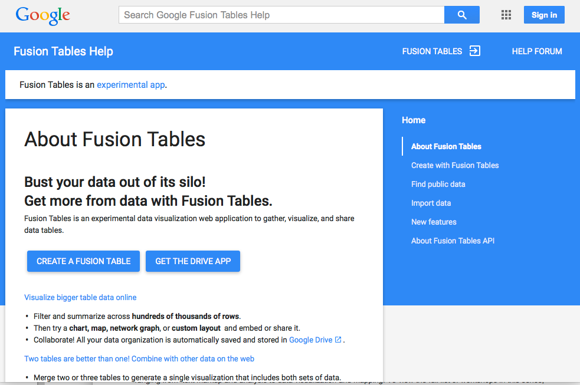
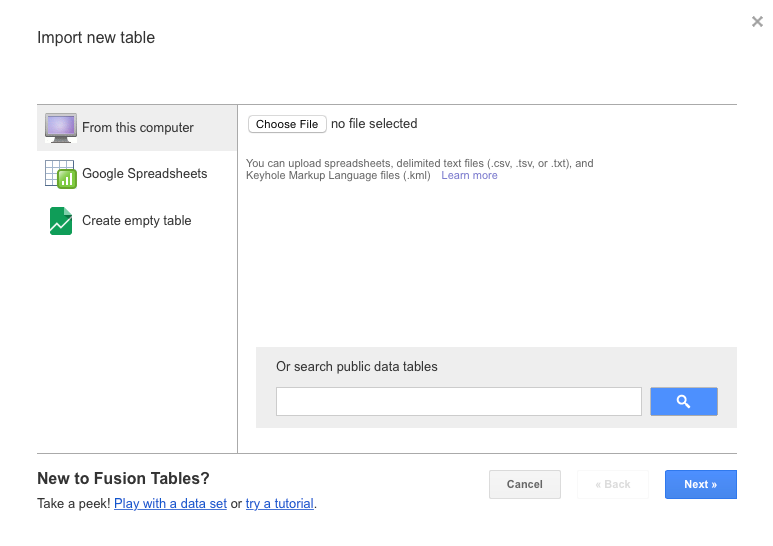
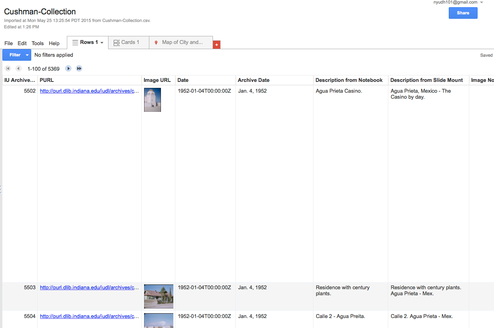
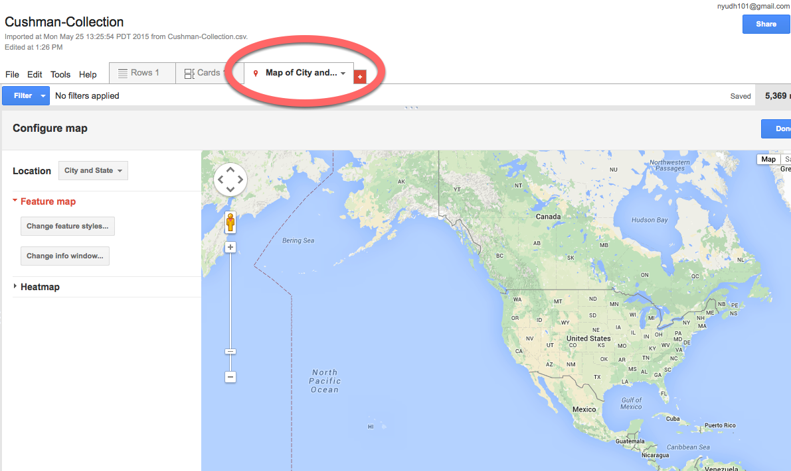
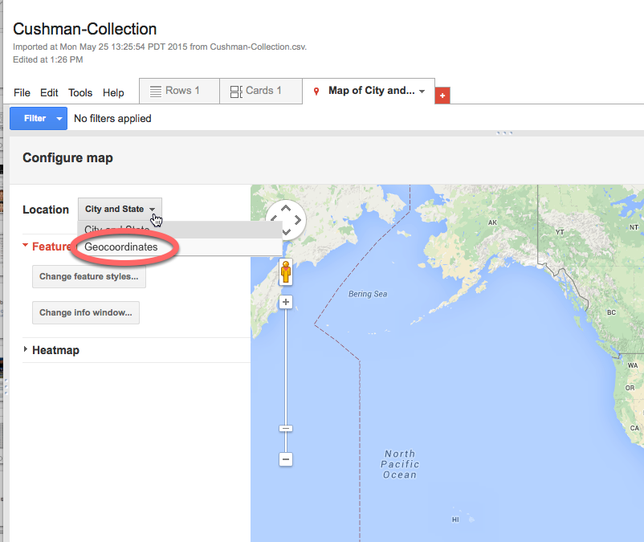
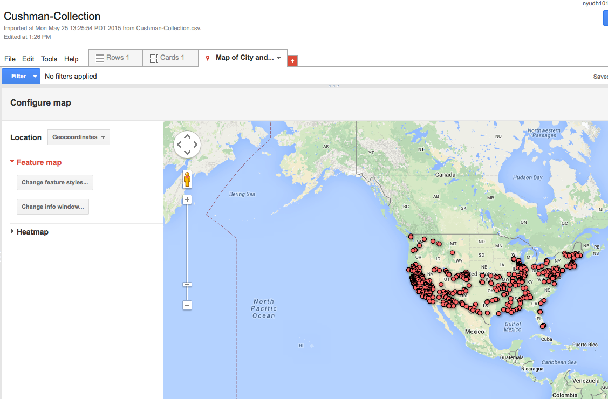
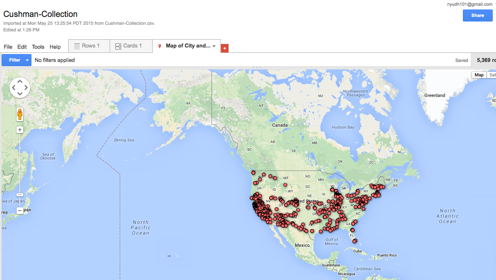
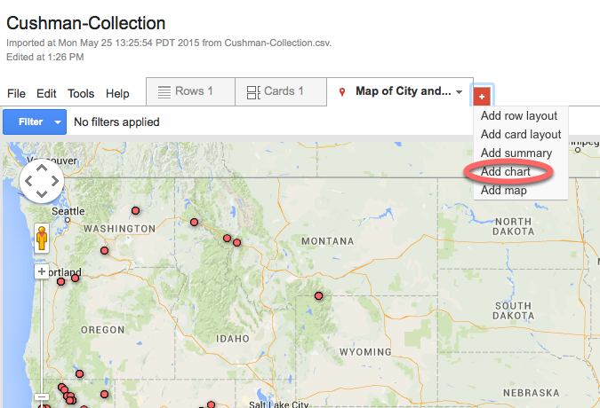
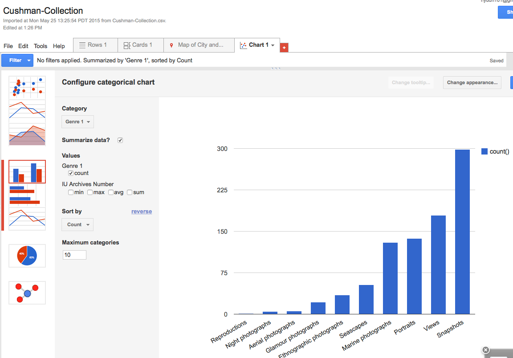
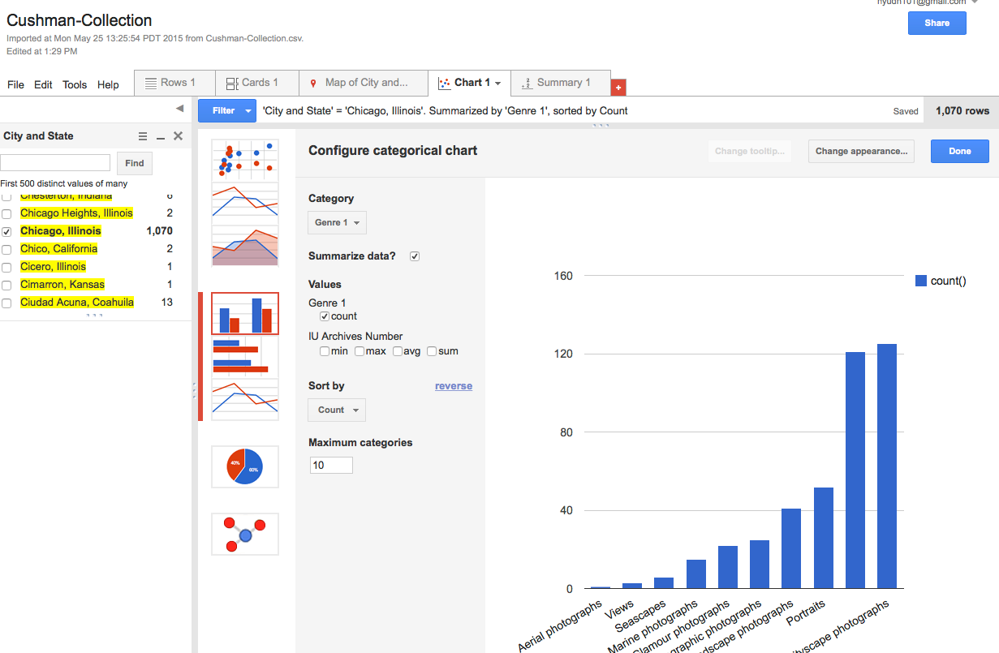

Google Fusion Table Basics with IU's Cushman Collection
=======================================================

Google Fusion Tables is a fairly simple way to go from spreadsheet to
data visualization. In this tutorial, you'll upload a spreadsheet
containing information about the University of Indiana's Cushman
Collection of photographs (which you can find at
bit.ly/cushmancollection) and use it to create a map and some charts.

Open Google fusion tables
-------------------------

Go to Fusion Tables, located here: [https://support.google.com/fusiontables/answer/2571232?hl=en](https://support.google.com/fusiontables/answer/2571232?hl=en).

Click on "Create a Fusion Table" and sign in with your Google account
---------------------------------------------------------------------

Once you're in, click on **Choose File** and then select the
Cushman-Collection file. For **Separator Character**, keep the options
as they are (with **Comma** selected) and then click **Next**. On the
next screen, click **Next** again, and finally, click **Finish**.

Hey, that's kind of cool.
-------------------------

The next screen shows you your spreadsheet just as it was when you were
looking at it in Excel — except Google has automatically pulled in
thumbnail images for all the direct links to photographs.

Check out a map of locations
----------------------------

Click on the **Map of City and State** tab, but — IMPORTANT — click on
"Pause Geocoding" on the window that pops up. In order to place your
locations on the map, you need latitudes and longitudes. Google is
trying to be helpful by retrieving these for you. But that will take a
long time, and actually your spreadsheet already contains this
information. So we need to inform Google of this.

On the "Location" dropdown, click "Geocoordinates"
--------------------------------------------------

That way Google will use the latitude and longitude data you've already
provided.

Hey, you have a map!
--------------------

Pretty cool. You can click on each of the points to see which photo was
taken there. Play with the various options to see what you get.

Share, if you want.
-------------------

You can share this map if you want! Just click on the **Share** button
and share the map the same way you'd share a Google doc. You can also
embed the map on a website by clicking on **Tools** and then
**Publish**.

Make some graphs and charts.
----------------------------

Let's look at some other views of the same data. Click on the red "plus"
sign on the tabs menu and select **Add Chart**.

Make a bar chart.
-----------------

Click on the **bar chart** icon and for **Category**, select **Genre
1**. Be sure to uncheck "Value: IU Archives Number" and *do* check the
**Summarize data** checkbox. (An easier way to create a summary bar
chart is just to choose the **Summarize** option when you're opening a
new tab — but this way we can switch among different chart types.)

Filter your data.
-----------------

Fusion Tables allows you to drill down into your data by filtering it.
Try adding a **City, State** filter.

Play with other chart types.
----------------------------

Use these charts to explore your dataset as you try to get a sense of
its contours. Pay attention to what the data can and can't tell you
about the collection of photographs.
